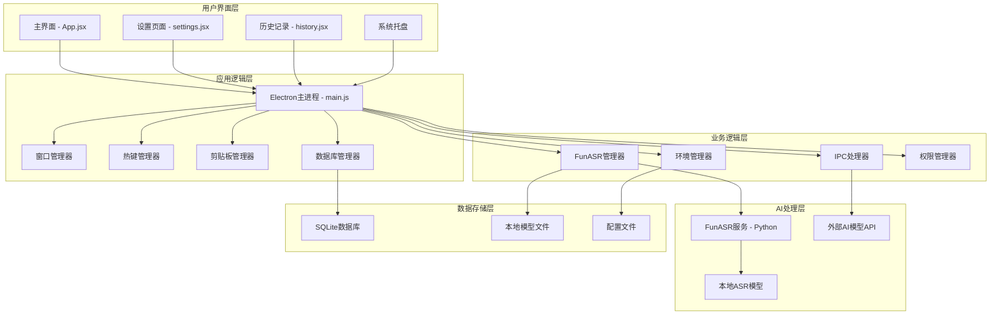
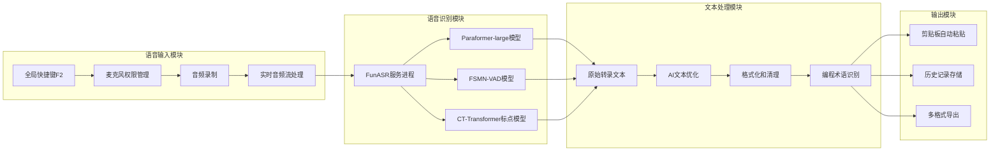
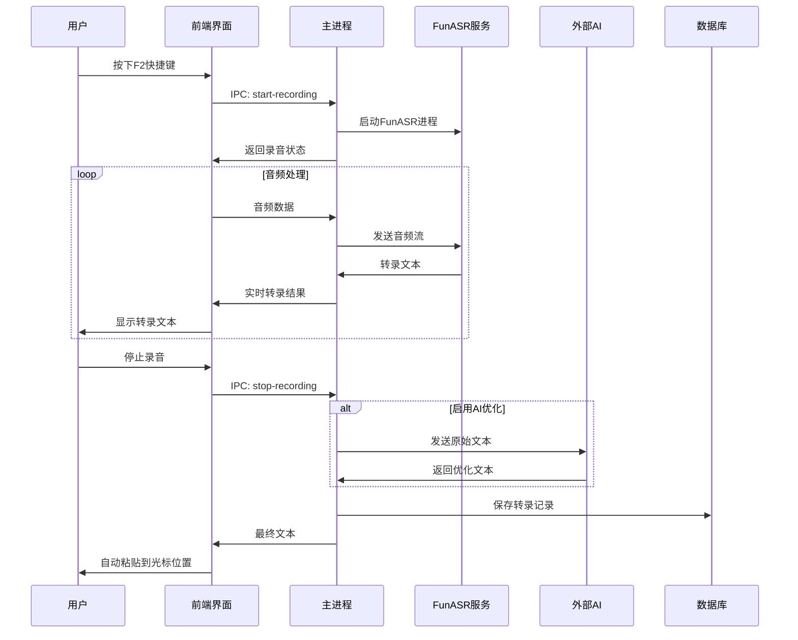
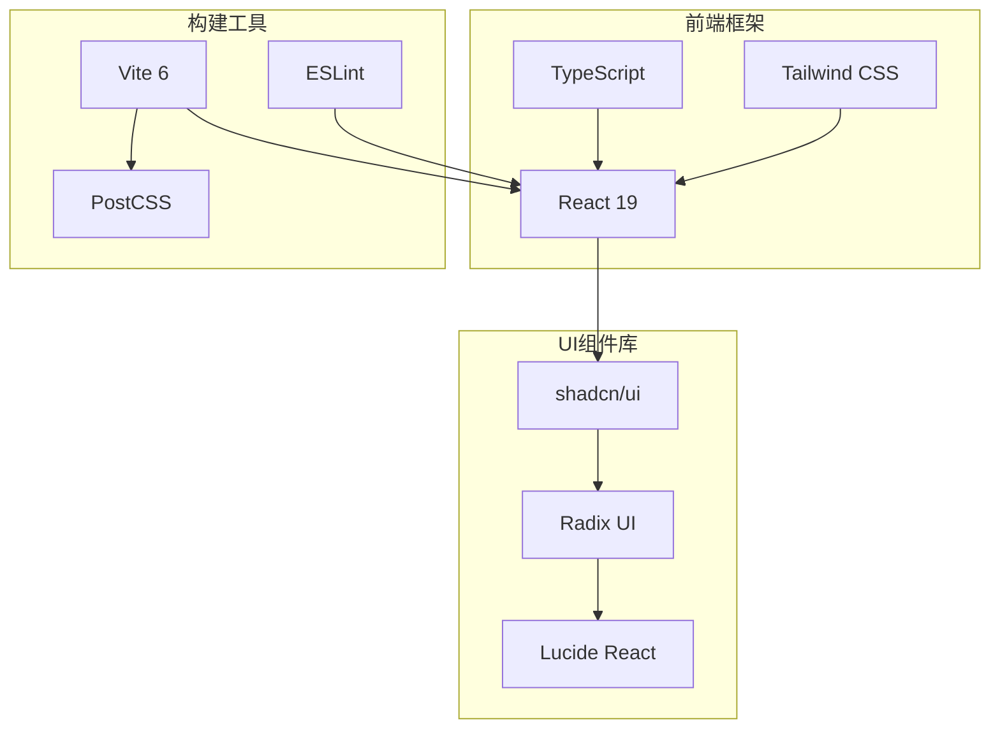
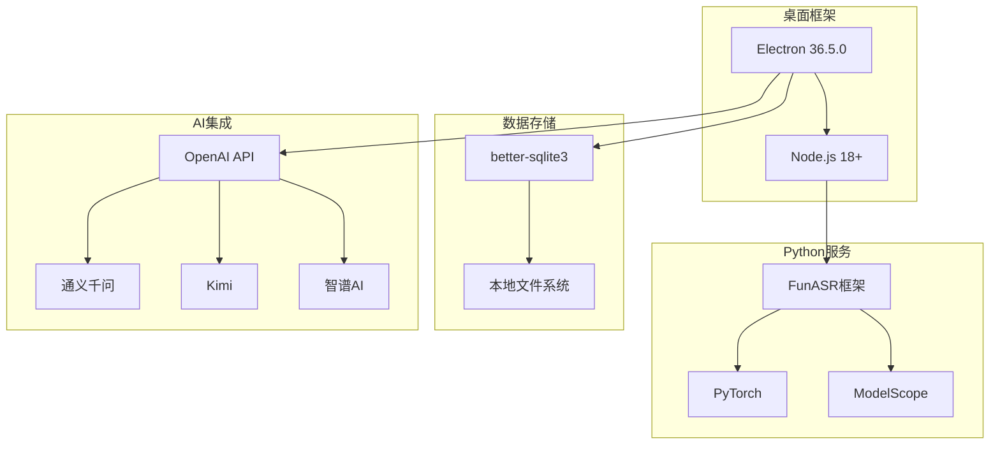
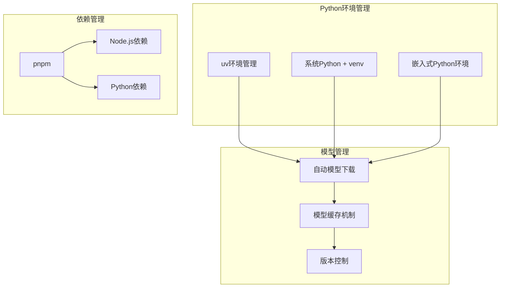

# 蛐蛐 (QuQu) 产品架构分析

## 1. 产品定位与核心价值主张

### 1.1 产品定位
**蛐蛐 (QuQu)** 是一个专为中文用户设计的开源免费桌面端语音转文字应用，定位为 Wispr Flow 的直接替代方案。

### 1.2 核心价值主张
- **零成本**: 完全开源免费，无订阅费用
- **隐私优先**: 数据本地处理，不上传云端
- **中文优化**: 专为中文语言和互联网文化优化
- **国产AI支持**: 优先适配国内AI模型
- **开发者友好**: 支持编程术语和代码格式化

### 1.3 目标用户群体

#### 主要目标用户
1. **中文内容创作者** (30%)
   - 博客作者、自媒体运营者
   - 需要大量文字输入的编辑和记者
   - 偏好本地处理的隐私敏感用户

2. **开发者和技术人员** (25%)
   - 需要编写技术文档的程序员
   - 代码注释和API文档编写
   - 技术博客创作者

3. **商务办公人士** (20%)
   - 需要撰写邮件和报告的白领
   - 会议记录和纪要整理
   - 对成本敏感的企业用户

4. **学生和研究人员** (15%)
   - 论文写作和文献整理
   - 课堂笔记和复习资料
   - 预算有限的学术用户

5. **技术爱好者** (10%)
   - 开源软件支持者
   - 隐私保护倡导者
   - 喜欢折腾和定制的极客用户

## 2. 详细产品架构图

### 2.1 整体系统架构

### 2.2 核心功能模块架构

### 2.3 数据流架构

## 3. 技术栈架构分析

### 3.1 前端技术栈

### 3.2 后端技术栈

### 3.3 环境管理架构

## 4. 核心功能模块详细设计

### 4.1 语音识别引擎
- **模型选择**: 阿里巴巴 FunASR Paraformer-large
- **支持语言**: 专门优化的中文识别
- **特色功能**:
  - 中文互联网热词识别
  - 方言口音适应性
  - 实时流式识别
  - 低延迟处理

### 4.2 AI文本优化引擎
- **支持模型**: OpenAI API兼容的所有模型
- **优先适配**: 通义千问、Kimi、智谱AI等国产模型
- **优化能力**:
  - 口语化表达转换
  - 语法错误修正
  - 标点符号自动添加
  - 编程术语格式化

### 4.3 隐私保护机制
- **本地处理**: 所有语音和文本数据本地处理
- **零数据上传**: 不向任何第三方服务器传输数据
- **配置加密**: 敏感配置信息本地加密存储
- **用户控制**: 完全的数据删除和导出权限

## 5. 竞争优势分析

### 5.1 vs Wispr Flow 对比
| 维度 | 蛐蛐 (QuQu) | Wispr Flow |
|------|-------------|------------|
| **价格模式** | 完全免费 | $12/月订阅 |
| **隐私保护** | 本地处理 | 云端处理 |
| **中文支持** | 深度优化 | 通用支持 |
| **AI模型** | 国外+国产模型 | 仅国外模型 |
| **开源程度** | 完全开源 | 闭源商业软件 |
| **定制性** | 高度可定制 | 有限定制 |
| **部署方式** | 本地部署 | SaaS服务 |

### 5.2 核心竞争优势
1. **成本优势**: 零使用成本，无订阅费用
2. **隐私优势**: 完全本地处理，数据不上传
3. **本土化优势**: 针对中文深度优化
4. **生态优势**: 支持国产AI模型生态系统
5. **技术优势**: 开源可定制，社区驱动发展
6. **合规优势**: 符合国内数据保护法规要求